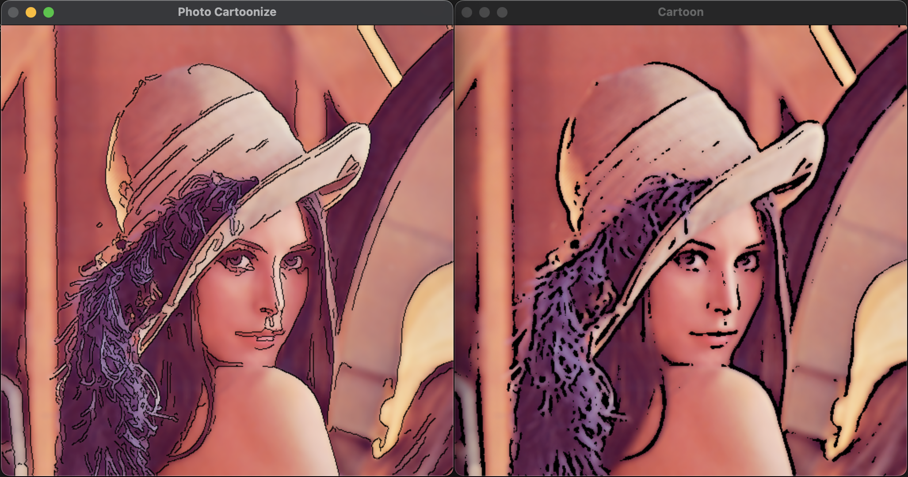

# Photo Cartoonize

This project converts image or video to cartoon using image processing.

## Contents

- cartoonize.py: Converts OpenCV image to cartoon-like image
- photo_cartoonize.py: Example code for cartoonize image
- video_cartoonize.py: Example code for cartoonize video
- chatgpt_generated.py: ChatGPT generated code

## Result

### Photo

*Left: Photo Cartoonize, Right: ChatGPT Generated Code*

### Video

